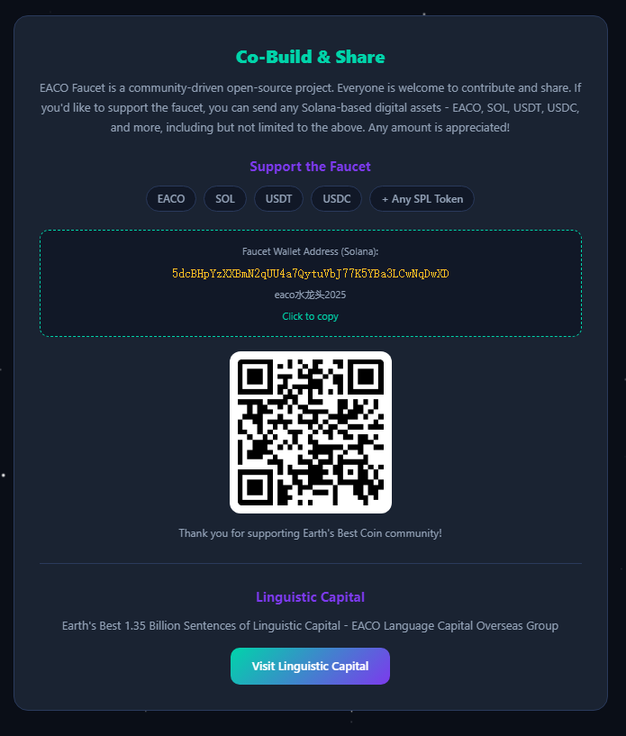
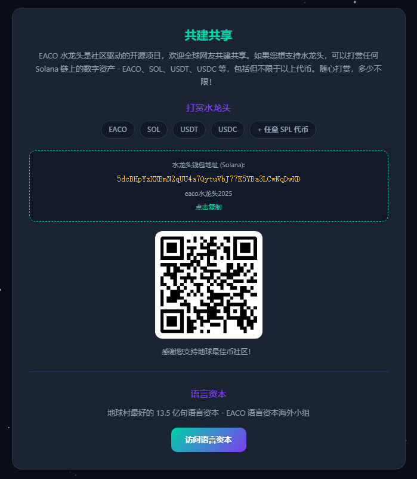

# EACO Faucet v0.01 - Zero-Barrier Edition (演示版本)

> ⚠️ **重要声明：这是一个演示/开源代码仓库，不是正在运行的生产服务。**
> 
> 本仓库包含 EACO 水龙头的完整前端代码和后端代码示例。
> **要运行真实的水龙头服务，您需要自己部署后端、生成私钥、充值代币。**
> 
> **当前版本：v0.01（演示版）** - 包含零门槛领取演示功能。

**地球村零门槛领取 EACO 水龙头 - 演示版**

---

## 这是什么？

这是一个**开源演示项目**，展示了如何构建一个零门槛的 Solana SPL 代币水龙头：

- 用户**无需拥有 SOL、无需连接钱包、无需签名任何交易**
- 只需提供一个 Solana 公钥地址即可"领取"代币
- 项目方（服务端）代为支付所有网络费用（gas）和代币账户创建费（ATA rent）

**本项目仅包含代码，不包含正在运行的服务。**

---

## Welcome Earth Villagers / 欢迎地球村网友共建共享

This is an open-source community project. Everyone is welcome to contribute - code, translations, bug reports, or ideas!

这是一个开源社区项目，欢迎所有人参与共建 - 代码、翻译、Bug 报告或创意都可以！

### How to Contribute / 参与方式

1. Fork this repository
2. Create your feature branch (`git checkout -b feature/amazing-feature`)
3. Commit your changes (`git commit -m 'Add amazing feature'`)
4. Push to the branch (`git push origin feature/amazing-feature`)
5. Open a Pull Request

Contributors can earn EACO rewards (50-500 EACO per accepted PR).

## Features

- **Free EACO Claims** - 50-100 EACO per claim, once per 7 days (168 hours) per wallet
- **3 Themes** - Space (default), Earth, Business
- **6 Languages** - Chinese, English, Spanish, French, Russian, Arabic
- **Bilingual Toggle** - One-click EN/CN switch
- **No Database** - File-based (PHP) or on-chain (Rust PDA) anti-duplicate
- **Wallet Connect** - Phantom, Solflare, OKX, Backpack, Gate, Binance, Coinbase, Glow
- **Responsive** - Mobile-friendly design
- **Safe** - Private keys never exposed to frontend

## Project Structure

```
eaco-faucet/
|-- index.html          # Main frontend page
|-- js/
|   |-- config.js       # Frontend config (backend URL)
|   |-- i18n.js         # 6-language translations + links data
|   |-- app.js          # Wallet connect, claim logic, themes, starfield
|-- server/
|   |-- config.php      # Backend configuration
|   |-- claim.php       # Claim endpoint (file-based anti-duplicate)
|   |-- stats.php       # Stats endpoint
|   |-- signer.js       # Node.js signing service
|   |-- package.json    # Node.js dependencies
|-- rust/
|   |-- eaco_faucet.rs  # Solana program (Anchor framework)
|   |-- Cargo.toml      # Rust dependencies
|   |-- Anchor.toml     # Anchor config
|-- .gitignore
|-- README.md
```

## Quick Start

### Option A: Demo Mode (GitHub Pages)

1. Upload all files to your GitHub repository
2. Enable GitHub Pages in repo settings
3. The site runs in **demo mode** - claims are simulated

### Option B: Live Mode (Self-hosted)

1. **Frontend**: Upload `index.html` and `js/` to your web server
2. **Backend**: 
   - Install PHP 7.4+ on your server
   - Install Node.js 16+ for the signer service
3. **Configure**:
   - Edit `js/config.js`: Set `window.EACO_BACKEND` to your server URL
   - Edit `server/config.php`: Set `CORS_ORIGIN` to your frontend URL
4. **Generate faucet keypair**:
   ```bash
   solana-keygen new -o server/faucet-keypair.json
   ```
5. **Fund the faucet wallet** with EACO tokens
6. **Start signer service**:
   ```bash
   cd server
   npm install
   node signer.js
   ```
7. **Start PHP** (if using Apache/Nginx, PHP is already served)

## ⚠️ 重要：运行真实水龙头，你需要自己做什么

本仓库**仅包含可公开的代码文件**。以下文件**故意没有上传**，需要您自己创建：

### 1. 水龙头私钥文件（必须）

```bash
# 生成新的 Solana 密钥对（这将是您的"水龙头钱包"）
solana-keygen new -o server/faucet-keypair.json

# ⚠️ 警告：
# - 此文件包含私钥，永远不要上传到 GitHub
# - 本仓库的 .gitignore 已自动排除此文件
# - 请妥善备份，丢失意味着丢失所有代币
```

### 2. 给水龙头钱包充值（必须）

```bash
# 向水龙头钱包充值 SOL（用于支付 gas 费）
# 建议至少 0.1 SOL，每次领取消耗约 0.003 SOL
```

### 3. 后端服务部署（必须）

```bash
# 安装 Node.js 依赖
cd server
npm install

# 启动签名服务（在服务器后台运行）
node signer.js

# 配置 PHP 环境（Apache/Nginx + PHP 7.4+）
# 将 server/ 目录放在 web 根目录之外，通过 PHP-FPM 或 CGI 调用
```

### 4. 配置文件调整（必须）

```php
// server/config.php
// 修改以下配置：
define('CORS_ORIGIN', 'https://your-domain.com');  // 您的域名
define('FAUCET_KEYPAIR_PATH', __DIR__ . '/faucet-keypair.json');  // 私钥路径
```

```javascript
// js/config.js
// 修改后端 API 地址：
window.EACO_BACKEND = 'https://your-server.com/server';
```

### 5. 领取记录存储（自动创建）

```
server/data/          # 此目录会被自动创建
├── claims.json      # 地址领取记录（7天冷却）
├── ip_records.json  # IP 限频记录（30分钟）
└── stats.json       # 统计数据
```

### 6. 可选：Rust 链上程序

```bash
cd rust
# 安装 Anchor
cargo build
# 部署到 Solana 网络（需要 ~0.5 SOL 租金）
anchor deploy
```

---

## EACO Token Info

| Field | Value |
|-------|-------|
| Name | EACO (Earth's Best Coin) |
| Symbol | EACO / E |
| Blockchain | Solana |
| Type | SPL Token |
| Contract Address | `DqfoyZH96RnvZusSp3Cdncjpyp3C74ZmJzGhjmHnDHRH` |
| Faucet Wallet | `5dcBHpYzXXBmN2qUU4a7QytuVbJ77K5YBa3LCwNqDwXD` |
| Core Concept | Energy x Attitude x Cooperation x Optimization |

## Community Donations / 社区打赏

EACO Faucet is a community-driven project. If you'd like to support the faucet, you can send any Solana-based digital assets to the faucet wallet:

**Faucet Wallet Address**: `5dcBHpYzXXBmN2qUU4a7QytuVbJ77K5YBa3LCwNqDwXD`

Accepted tokens (including but not limited to):
- EACO
- SOL
- USDT
- USDC
- Any SPL token on Solana

Every contribution helps keep the faucet running for Earth villagers worldwide.

## Security Architecture

### Layer 1: Frontend (HTML + JS)
- Wallet connection via Phantom/Solflare
- Local cooldown check (localStorage)
- No private keys in frontend code

### Layer 2: Backend (PHP, file-based)
- Address cooldown tracking (JSON files)
- IP rate limiting (JSON files)
- File locking for concurrent safety
- Calls Node.js signer for actual transactions

### Layer 3: Signer (Node.js)
- Holds faucet keypair in memory
- Only listens on 127.0.0.1 (localhost)
- Signs SPL token transfer transactions
- No CORS headers (internal only)

### Layer 4: On-chain (Rust, optional)
- PDA-based claim records
- On-chain anti-duplicate
- Authority-controlled parameters
- No external database needed

## Claim Flow

```
User connects wallet
    |
    v
User selects amount (50-100) and clicks "Claim"
    |
    v
Frontend checks localStorage cooldown ---> if < 168h, reject
    |
    v
Frontend POST to PHP backend /claim.php
    |
    v
PHP checks file-based claim records ---> if < 168h, reject
    |
    v
PHP checks IP rate limit ---> if < 30min, reject
    |
    v
PHP calls Node.js signer /send
    |
    v
Signer loads faucet keypair, builds SPL transfer tx
    |
    v
Signer broadcasts to Solana RPC
    |
    v
PHP records claim (claims.json), updates stats
    |
    v
Frontend shows success + tx link to Solscan
```

## Deployment: GitHub Pages

1. Create a repo like `ucoingroup.github.io/eaco-faucet`
2. Push all files
3. Settings -> Pages -> Source: main branch
4. Site will be at `https://ucoingroup.github.io/eaco-faucet/`
5. Runs in **demo mode** (no backend)

For live mode, deploy frontend to GitHub Pages and backend to a VPS.

## Language Support

| Code | Language | RTL |
|------|----------|-----|
| zh-CN | Chinese | No |
| en | English | No |
| es | Spanish | No |
| fr | French | No |
| ru | Russian | No |
| ar | Arabic | Yes |

## Theme Switching

| Theme | Description |
|-------|-------------|
| Space (default) | Deep blue background + neon colors + animated starfield |
| Earth | Green natural tones |
| Business | Blue-white professional style |

## Footer Links

The footer contains 13 EACO ecosystem links:
1. Earth's Best Coin
2. EACO 50 Rate
3. 100 Ways To Wealth
4. Earth 100 Friends
5. EACO SWAP
6. Good Books
7. EUR-EACO
8. AU Trade
9. Mohist Tech
10. Earth Village School
11. EACO Build World
12. EACO Web3
13. Linguistic Capital

## Important Warnings

- **Never share your private key or mnemonic phrase**
- **Always verify the contract address**: `DqfoyZH96RnvZusSp3Cdncjpyp3C74ZmJzGhjmHnDHRH`
- **EACO is a community MEME token** - not financial advice (DYOR)
- **Crypto is volatile** - prices can go to zero
- **Only connect wallets to sites you trust**

## Tech Stack

- Frontend: HTML5, CSS3, vanilla JavaScript (no framework)
- Backend: PHP 7.4+ (file-based storage, no database)
- Signer: Node.js 16+ with @solana/web3.js and @solana/spl-token
- On-chain: Rust with Anchor framework (optional)
- Wallet: Phantom / Solflare / Backpack

## License

MIT - Free to use, modify, and distribute.

## EACO Community

- Contract: `DqfoyZH96RnvZusSp3Cdncjpyp3C74ZmJzGhjmHnDHRH`
- EACO = Energy x Attitude x Cooperation x Optimization
- Earth's Best AI + RWA + Web3 Coin

---

EACO Faucet - Free EACO Token Claim Website **v0.01 (Demo)**

## Contact

- **Email**: eaco2cc@gmail.com

## Screenshots

**Co-Build & Share (English)**



**共建共享 (中文)**


